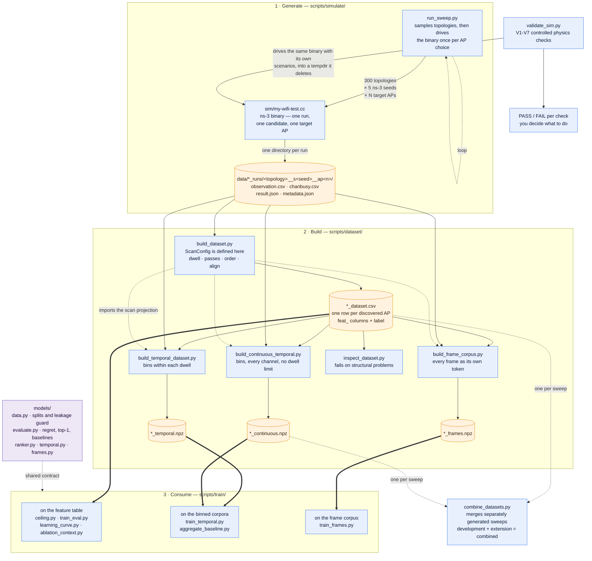

# wifi-ap-selection

Learning which WiFi access point a client should join, from what its radio
can observe *before* it associates.

An ns-3 simulation generates realistic multi-AP scenarios; a client scans,
picks an AP, and the throughput it then achieves becomes the label. The
learning task is a **choice set**: one scenario, one pre-association
observation, and one label per AP discovered by the client's scan.

## How it fits together



Rounded boxes are artifacts on disk; rectangles are code. A solid arrow means
"produces or drives"; a dotted one is a code dependency, not data.

**Read the first stage as control flow, not data flow.** `run_sweep.py` and
`validate_sim.py` both *invoke* the ns-3 binary - nothing flows out of the
simulator into them. They are the two drivers of the same executable, and they
do not read each other's output.

### What `run_sweep.py` does

The label this project needs is *the throughput a client would get after joining
AP k*, and that is only defined once the client has joined. One simulation run
answers the question for exactly one AP. So the script re-runs the same physical
situation once per AP, changing nothing but which AP the candidate joins:

```
for each of 300 topologies:              # AP layout, station count, offered load,
    sample the physical scenario         # candidate position - fixed by topologySeed
    draw 5 independent ns-3 seeds        # fading, contention, rate control
    for each seed:
        for each AP in the topology:     # <- the ONLY thing that varies
            run the ns-3 binary
```

Each innermost run becomes one directory, named
`<topology>__s<seed>__ap<target>`. So topology `g00007` with 3 APs produces 15
directories: 5 seeds x 3 APs.

Three levels, and the vocabulary matters because the rest of the code uses it:

| level | what is held fixed | what varies | id |
|---|---|---|---|
| **topology** | layout, load, candidate position | - | `g00007` |
| **group** (choice set) | all of the above, plus one ns-3 seed | - | `g00007__s02` |
| **run** | everything | which AP was joined | `g00007__s02__ap1` |

A **group** is the unit of learning: one physical situation, one pre-association
observation, and one label per AP the client could have joined. The runs inside
it differ only in the label, which is what makes the comparison between APs a
comparison of *choices* rather than of situations. This is why the candidate is
placed in absolute coordinates rather than at an offset from its target - an
offset would move the client whenever the target changed, and the runs would no
longer describe the same situation.

A **topology** is the unit of splitting. Its 5 seed realisations always move into
train, validation or test together, or a model scores well by recognising a
layout it has already seen.

`validate_sim.py` shares nothing with this. It drives the same binary with its
own controlled scenarios (throughput vs distance, vs offered load, determinism,
matched-set identity), writes into a temporary directory it deletes on exit, and
reports PASS/FAIL per check. It reads no dataset and produces no dataset.

Two more things the diagram is meant to make obvious. `build_dataset.py` is the
single definition of the scan projection - the other builders import
`ScanConfig`, `single_radio_sweep` and `apply_rssi_realism` from it rather than
redefining them, so a change to what the client is assumed to have heard reaches
every corpus at once. And `models/` holds the rules that must not vary between
experiments: what counts as an observable feature, how splits are drawn, and how
a decision is scored.

`combine_datasets.py` does not split anything. Each sweep is generated
independently - `development` (200 topologies) and `extension` (100) were run
separately under different `--group-prefix` values - and each is built into its
own CSV and NPZ. Combining is how a later sweep is added to an earlier one
without regenerating either; the script's job is to refuse the merge if the
topology or group IDs collide.

## Layout

| Path | Role |
|---|---|
| `sim/my-wifi-test.cc` | The ns-3 simulation. Symlinked into `ns-3.45/scratch/`. |
| `scripts/simulate/validate_sim.py` | Drives the binary with its own scenarios; seven physics checks (V1-V7). Reads no dataset. |
| `scripts/simulate/run_sweep.py` | Drives the ns-3 binary once per topology x seed x target AP. |
| `scripts/dataset/build_dataset.py` | Observations → choice-set feature table. |
| `scripts/dataset/inspect_dataset.py` | Describes a dataset and fails on structural problems. |
| `scripts/train/train_eval.py` | Trains all models, selects on validation, reports on test. |
| `scripts/train/ablation_context.py` | Whether the set context beats hand-built relative features. |
| `models/data.py` | Loading, imputation, group-wise splits, leakage guard. |
| `models/evaluate.py` | Regret / top-1 / Spearman, plus the heuristic baselines. |
| `models/baseline.py` | Tree ensembles with permutation importance. |
| `models/ranker.py` | DeepSets-style pairwise ranker (and its pointwise ablation). |
| `models/temporal.py` | Transformer over ordered passive-scan bins and AP option sets. |
| `scripts/dataset/build_temporal_dataset.py` | Raw observations to compact ordered scan tensors. |
| `scripts/dataset/build_continuous_temporal.py` | All-channel superset corpus: no dwell restriction. |
| `scripts/dataset/build_frame_corpus.py` | Raw frame trace: every decoded frame as its own token. |
| `models/frames.py` | Perceiver over the frame trace; relational identity, no MACs. |
| `scripts/train/train_frames.py` | Trains the raw-frame model (Experiment A). |
| `scripts/dataset/combine_datasets.py` | Schema-safe combination of independent CSV/NPZ sweeps. |
| `scripts/train/train_temporal.py` | Temporal throughput-regression and AP-ranking experiments. |
| `scripts/train/learning_curve.py` | Topology-held-out data-scaling check before generating more. |
| `scripts/train/ceiling.py` | Genie-on-ground-truth vs observed, bounding the observation gap. |
| `scripts/train/aggregate_baseline.py` | Tabular models on the transformer's own input, to remove the confound. |

## Setup

```bash
# ns-3.45 lives alongside this repo. NS3_WARNINGS_AS_ERRORS=OFF is required:
# an unrelated warning in ns-3's own ipv4-l3-protocol.cc otherwise fails the build.
cmake -S ../ns-3.45 -B ../ns-3.45/cmake-cache-release -G Ninja \
      -DCMAKE_BUILD_TYPE=Release -DNS3_EXAMPLES=OFF -DNS3_TESTS=OFF \
      -DNS3_VISUALIZER=OFF -DNS3_WARNINGS_AS_ERRORS=OFF
ninja -C ../ns-3.45/cmake-cache-release ns3.45-my-wifi-test

python3 -m venv .venv
.venv/bin/pip install numpy pandas scikit-learn matplotlib
.venv/bin/pip install torch --index-url https://download.pytorch.org/whl/cpu
```

The bundled `./ns3` wrapper does not run under Python 3.14 (an argparse
incompatibility unrelated to this project), so CMake and Ninja are driven
directly. Use the release build for anything at scale — debug is ~20x slower.

## Pipeline

```bash
BIN=../ns-3.45/build/scratch/ns3.45-my-wifi-test

.venv/bin/python scripts/simulate/validate_sim.py --binary $BIN --workers 10
.venv/bin/python scripts/simulate/run_sweep.py --binary $BIN --out-dir data/runs \
    --n-groups 200 --seeds-per-topology 5 --workers 12 --max-output-gb 10
.venv/bin/python scripts/dataset/build_dataset.py data/runs --out data/dataset.csv \
    --single-radio-sweep --sweep-mode passive     # see "one radio" below
.venv/bin/python scripts/dataset/build_temporal_dataset.py data/runs data/dataset.csv \
    --out data/temporal.npz
.venv/bin/python scripts/dataset/inspect_dataset.py data/dataset.csv
.venv/bin/python scripts/train/train_eval.py data/dataset.csv --out-dir results/main/
.venv/bin/python scripts/train/train_temporal.py data/temporal.npz \
    --out-dir results/temporal/
.venv/bin/python scripts/train/learning_curve.py data/dataset.csv \
    --out results/learning_curve.csv
```

The sweep resumes run directories that already contain complete outputs and
checks storage while new jobs finish. It stops scheduling at 95% of
`--max-output-gb`, leaving headroom for the workers already in flight rather
than discovering a full disk after a long run.
Use a distinct `--group-prefix` when a second independently seeded sweep will
later be combined with the first; topology IDs must remain globally unique.

The completed bounded corpus combines 200- and 100-topology sweeps and keeps
their IDs distinct. It occupies 1.7 GB including the pilot and derived files.
The first learning curve justified the 100-topology extension; the combined
curve showed smaller 0.13--0.23 Mbps gains at its final step, so generation
stopped. Treat 10 GB as a safety ceiling, not a generation target.

## Simulator 1 assumptions

Simulator 1 intentionally exposes only the scenario choices needed by the
matched-set experiment. The main sweep uses 2, 3, 4, 6, or 8 APs at 30 m
spacing. Two APs form one pair, three form an equilateral triangle, and the
even counts use regular 2x2, 3x2, and 4x2 grids. Channels 36, 40, 44, and 48
are assigned in AP-index order and reused only beyond four APs. Packet size,
propagation, traffic start, candidate join time, observation guard, simulation
stop, and candidate saturation load are fixed in `sim/my-wifi-test.cc` rather
than exposed as incidental sweep parameters.

The number of crowded station regions is sampled rather than fixed. A quarter
of topologies have no hotspot. The rest favor one hotspot but may contain more,
capped at `min(3, ceil(nAPs / 3))`: at most one for 2/3 APs, two for 4/6 APs,
and three for 8 APs. When enabled, 70% of background stations are drawn across
the selected 10 m hotspot discs; the rest are uniform over the deployment.

The candidate always uses absolute `(x, y)` coordinates, so changing
`targetAP` cannot move it. `topologySeed` controls only background-station
placement; `rngSeed` controls ns-3's fading, contention, and rate-control
randomness. Consequently the default five seeds per topology preserve the
physical deployment while repeating its stochastic radio behaviour.

## One radio, not one per channel

The simulation gives the candidate a scanner radio *per channel*, each
listening until 0.5 s before association. Background traffic starts at t=1 s,
and the default association time is now 6 s, so the recorded pre-association
window contains 4.5 s of loaded traffic. That is an ns-3 convenience — retuning
a single radio mid-run is awkward — not a device. It makes the observation a
strict **superset** of what a real client sees, so `build_dataset.py`
recovers the real thing by keeping only the frames that fall inside the dwell
a sweeping radio would have scheduled on that frame's channel, and by
normalising rates and occupancy by that dwell rather than by the full window:

```bash
--single-radio-sweep          # off by default; without it you get the superset
--sweep-mode passive|active   # listen for beacons, or probe (see below)
--sweep-dwell-ms              # default 110 passive / 30 active — what devices
                              # ship: Linux mac80211 HZ/9 and HZ/33, Qualcomm
                              # gPassiveMaxChannelTime=110, gActive 20–40
--sweep-passes 1              # 0 = as many passes as the window fits
--sweep-order random          # channel visit order, redrawn per group
--sweep-align end             # scan ends when the client must decide
```

Simulator 1 uses passive scanning as its main observation regime. Active scan
support exists in the builder for comparison work, but probe-triggered
observations are being deferred to Simulator 2.

The simulator also writes `chanbusy.csv`: scanner-radio CCA-busy intervals
from the PHY state machine. These become `feat_chan_cca_busy_frac`, a channel
load feature that does not require decoding every frame.

RSSI is separately degraded to what a chipset reports — whole dBm, ±3 dB —
before any statistic is taken from it (`--rssi-noise-db`, `--rssi-quant-db`,
`--rssi-noise-model`; pass `0` to both for raw simulator values). Both stages
run at dataset-build time, so changing them costs seconds rather than another
ns-3 sweep. Everything is seeded per group (`--scan-seed`), so a rebuild is
reproducible and independent of `--workers`.

Defaults sweep off but RSSI realism on; `meta_scan_*` and `meta_rssi_*`
columns record what each dataset was built with.

Only APs discovered in the projected scan are emitted as model choices. In a
passive dataset, discovery requires at least one decoded beacon. Raw runs still
measure every configured AP, but an undiscovered AP is not presented to the
model, and a scan that discovers fewer than two APs is omitted because it has
no selection decision.

`run_sweep.py` defaults to five ns-3 seeds per sampled topology. The dataset
keeps each seed-realisation as its own choice set and records a shared
`topology_id`; splitting code uses that id so repeated versions of the same
physical layout do not leak across train and test.

## Two things to keep in mind

**Only `feat_*` columns may be model inputs.** `gt_*` columns are simulator
ground truth (true distances, true offered load, seeds) that a real client
cannot observe before associating. `models/data.py` enforces this; don't
route around it.

**Split by physical topology, never by row or seed realization.** Rows within a
choice set share one observation, and the five seed realizations share one
layout. A weaker split leaks near-copies of evaluation scenarios into training.
Use `split_by_group`; despite its historical name, it prefers `topology_id`.
